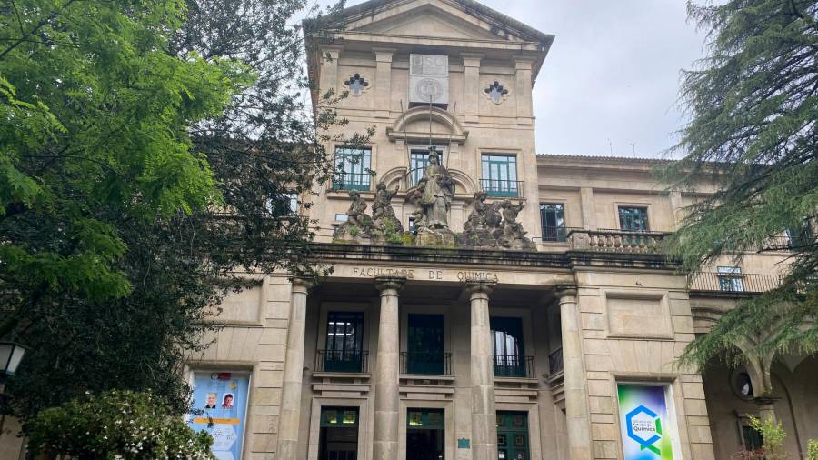

****
_Professor of Physical Chemistry_

**Address:** 

   

Departamento de Química Física. Facultade de Química.

Avda. das Ciencias s/n, 15782. Santiago de Compostela, SPAIN

[emilio.nunez@usc.gal](mailto:emilio.nunez@usc.gal)

My research is focussed on the development of theoretical models to study chemical reactions. See the publications for details.

Over the last years I've been involved in the Automated discovery of reaction Mechanisms and Kinetics: [AutoMeKin](https://github.com/emartineznunez/AutoMeKin)

